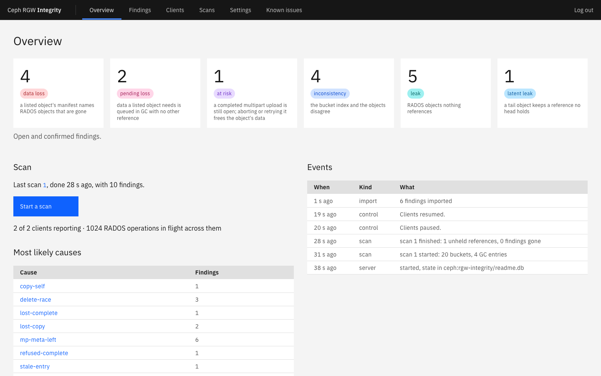
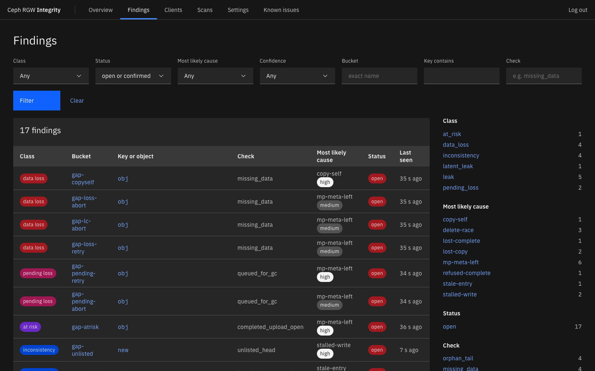
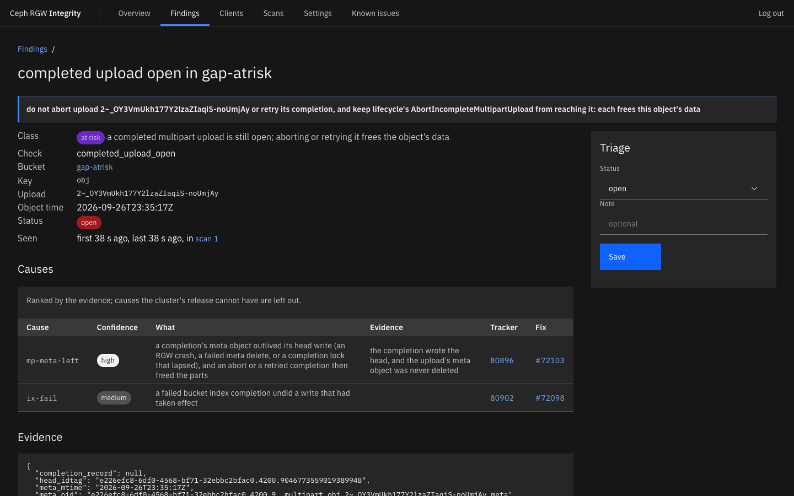
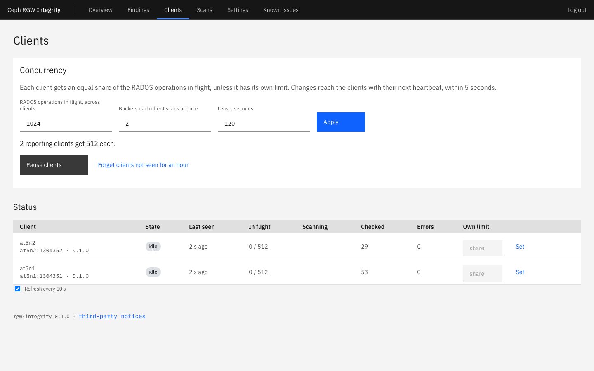
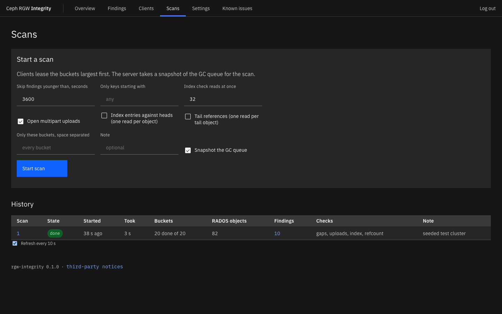
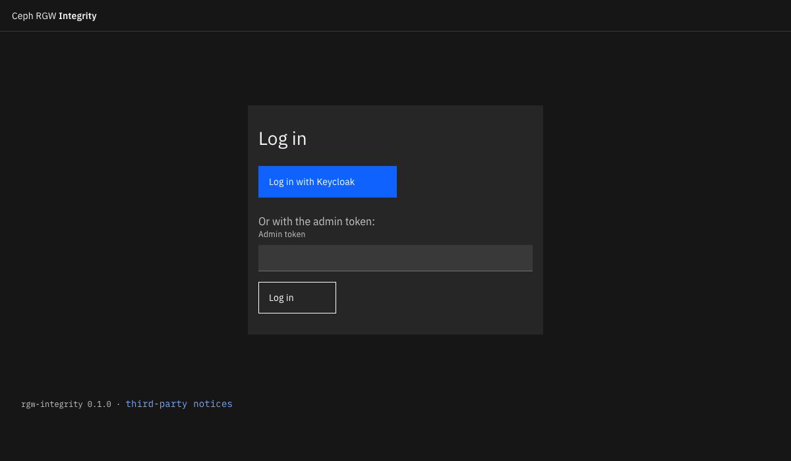

# rgw-integrity

Finds, and classifies, what known Ceph RGW races leave behind: data that is
gone or about to be, completed multipart uploads that an abort would destroy,
bucket index entries that disagree with the objects, and leaked RADOS
objects.  Each finding names the upstream issues that can leave that
artifact, ranked by the evidence and filtered by the cluster's release.

It grew out of `rgw-gap-list.py` in
[linuxkidd/ceph-misc](https://github.com/linuxkidd/ceph-misc), and writes
findings in the same JSON format.

## Status

- `scan`: a standalone scan from one host, the equivalent of
  `rgw-gap-list.py` with its classification.
- `server` and `client`: clients lease buckets, or the index shards of big
  ones, from the server and scan them in parallel; the server keeps state in RADOS through libcephsqlite, sets
  each client's share of a global concurrency, and can pause them.  Leases
  lapse to other clients when a client stops.
- Orphan detection: RADOS objects in the data pools that no bucket references,
  classified as leaks ( with their likely cause ), or as heads no listing
  shows.  See below.
- `import`: findings from `scan` or `rgw-gap-list.py`, into a server.
- `list`: a bucket's RADOS objects, or one index shard's, in the format of
  `radosgw-admin bucket radoslist --rgw-obj-fs`, read natively.
- A dashboard, in the IBM Carbon Design System, served by the server: what
  was found, filtered by class, cause, bucket and status, with each
  finding's evidence and triage; the clients, with the global concurrency
  and pause; and the scans.  It follows the system's light or dark theme,
  and needs no Internet access.

Both are tested against a vstart cluster seeded with each known race's
artifact; see `tests/`.

## Dashboard

From a vstart cluster seeded with each known race's artifact ( see `tests/` ).











## Single sign-on

The dashboard and the admin API can take logins from an OpenID Connect
provider ( Keycloak, IBM Security Verify, Okta, Entra ID, ... ):

```
rgw-integrity server ... --public-url https://rgwi.example.com:8443 \
  --oidc-issuer https://sso.example.com/realms/storage --oidc-client-id rgw-integrity \
  --oidc-client-secret-file /etc/rgw-integrity/oidc.secret \
  --oidc-allowed-groups storage-admins --oidc-name "IBM Security Verify"
```

- The login is the authorization code flow with PKCE; the server checks the
  ID token's signature against the provider's keys, and its issuer,
  audience, expiry and nonce.  Register `<public url>/oidc/callback` as the
  client's redirect URI, and `<public url>/login` as its post-logout one.
- Only `--oidc-allowed-users` and members of `--oidc-allowed-groups` ( the
  `--oidc-groups-claim`, `groups` by default ) get in, unless
  `--oidc-allow-any-user`.  Others are refused, and the refusal is logged.
- The admin API takes the provider's access tokens as bearer tokens, with
  the audience `--oidc-api-audience` ( the client id by default ) and the
  same rules, for automation.
- Logins are server-side sessions of 12 hours; logout ends the provider's
  session too.  Events name who changed what.
- `--oidc-only` removes the admin token's login from the dashboard; the
  token still works as the API's bearer token, and clients keep theirs.



## Listing

A bucket's RADOS objects come from its own index and heads, not from
`radosgw-admin bucket radoslist`: each index shard is paged through cls_rgw's
`bi_list`, each entry's head is read for its manifest ( `user.rgw.manifest` ),
and the manifest is walked as RGW's `obj_iterator` walks it; an open upload's
parts come from the part records in its meta object.  This is several times
faster than radoslist, reads nothing through RGW, and works a shard at a
time: every entry of a key ( its versions, its OLH, its uploads' meta and
part entries ) is in the shard its name hashes to, so each shard can be
checked on its own.

A bucket with more than `--shard-units-above` S3 objects ( 100,000 ) over
several shards becomes a unit per shard, which a server spreads over its
clients, and a standalone scan over its `--parallel` tasks.  The findings of
a sharded bucket are marked gone only once every shard is scanned.

`tests/compare_listing.sh` checks the native listing against radoslist,
object for object, and each shard's listing against the whole, on buckets
`tests/seed_listing_corpus.py` fills with sizes around the head and stripe
boundaries, multipart uploads open and completed, copies within and across
buckets, versions and delete markers, keys starting with `_`, a tenant's
bucket, and an index resharded to 13 shards.  They agree but where
radoslist is wrong:

- radoslist lists the heads of delete markers, which do not exist.
- With `--rgw-obj-fs`, radoslist leaves out open uploads' parts
  ( `RGWRadosList::run` returns before `do_incomplete_multipart` ).
- For a versioned key starting with `_`, radoslist names the key's OLH
  from its escaped index name: an object that does not exist, instead of the
  one that does.  rgw-gap-list reports a missing object for it
  ( rgw-orphan-list sets objects with locators aside, so it does not call
  the OLH an orphan ).

`--radoslist` ( or the dashboard's radoslist box ) lists with radosgw-admin
instead, a unit per bucket.

## Orphans

A scan with orphans ( `"orphans": true`, the dashboard's Orphans box, or
`scan --find-orphans` ) lists every object in the zone's data pools, and
keeps those no bucket's listing references.  Nothing holds the whole
cluster's names: both sides are split into partitions by a hash of the
object's name, about a million names each.

- Clients list the pools in slices ( librados's `rados_object_list_slice` ),
  and file the names by partition; bucket scans file a 16-byte hash of each
  name they list.  With a server, the partitions are objects in the
  `rgw-integrity-work` namespace of the database's pool ( or `--work-pool` );
  a standalone scan keeps them in a local directory.
- Once every bucket and pool slice is in, a join per partition keeps the
  names nothing references, and removes the partition.  If a bucket or a
  slice failed, the references are incomplete, and the joins are skipped
  rather than report false orphans.
- What the joins keep is classified together, by bucket marker, so that an
  unlisted head and its tail, or an upload's parts, make one finding.
  Objects newer than the scan's start, less the grace period, are skipped,
  as writes in flight; so are parts of open uploads, parts of uploads
  completed since their bucket was listed, and objects queued for GC.

It reads every object's name once, and holds about 90 bytes per name of a
partition while joining it.

## Build

Needs librados ( `librados-devel`, or a ceph build's `lib` directory ):

```
LIBRADOS_DIR=~/ceph/build/lib cargo build --release
```

`cargo test --no-default-features` runs the tests without librados.

## Server and clients

```
rgw-integrity server --db ceph:rgw-integrity/state.db --tls-cert server.pem --tls-key server.key
rgw-integrity client --server https://server:8443 --ca-cert ca.pem
```

The server writes a client token and an admin token to
`/etc/rgw-integrity/{client,admin}.token` on first start; clients read the
client token.  Start a scan with the admin token:

```
curl --cacert ca.pem -H "Authorization: Bearer $(cat admin.token)" -H 'Content-Type: application/json' \
  -d '{"options": {"grace": 3600, "check_index": false, "refcount": false, "uploads": true, "match_prefix": null, "threads": 32}}' \
  https://server:8443/api/v1/scans
```

## Scan

```
rgw-integrity scan -v                     # every bucket
rgw-integrity scan -v -b bucket1 -I -R    # one bucket, with the per-object checks
rgw-integrity scan -v -O orphan-list-*.out  # classify rgw-orphan-list output
rgw-integrity list -b bucket1 --shard 3     # one index shard's RADOS objects
```

Runs where `radosgw-admin` works, as client.admin by default ( `--id` ).
Supports Reef and later.  See `rgw-integrity scan --help`.

## License

LGPL-3.0: see `COPYING.LESSER`, and `COPYING` for the GPL-3.0 it extends.
